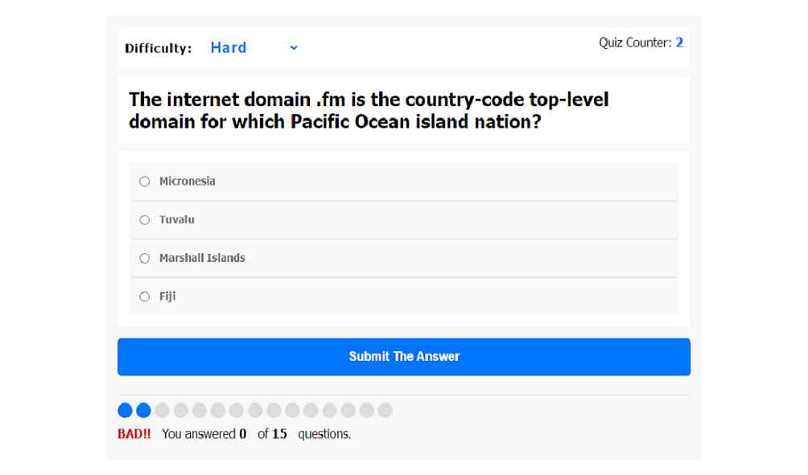

# Quiz-app

Quistion Game.
Question game , in computer science field, developed using: HTML, CSS and JS, Three levels.
easy , medium and hard, based on a tutorial by Osama Elzero.

    

        
    

    

        
    

    

            
        

    

        
    

